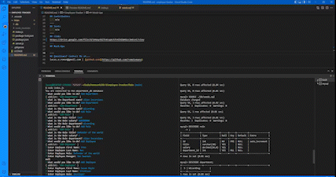

# Employee-Tracker

## Table of Contents
   1. [License](#license)
   2. [Project-Description](#description)
   3. [Installation-Guide](#installation-guide)
   4. [Project-Usage](#usage)
   5. [Project-Contributors](#contributors)
   6. [Project-Tests](#tests)
   7. [Links](#links)
   8. [Mock-Ups](#mock-ups)
   9. [Questions](#questions-contact-me-at)
--- 
## [License](./LICENSE)

---
## Description 
    This project leverages databases to store inforamtion about a comapanys employees, departments, roles and corresponding relatable information pertaining to the appropriate query. 
---
## Installation-Guide
    This project uses inquirer and mysql2. Express is also included as an optional use package. 1. open the intergrated terminal in the appropriate location (this should be the overall folder for the app) and execute ' npm i '. This will install the necessary packages. 2.In the same terminal execute ' mysql -u root -p  ' and when prompted enter your mysql password. Once in mysql terminal execute ' SOURCE ./db/schema.sql 'IF you would like to start with seeded tables, then execute ' SOURCE ./db/seeds.sql' to input beginning data in your newly created department database. 3. Your database should be created and ready for use. execute ' exit ' to return to your terminal. Now execute ' node index.js ' this will start the application and allow you to build your employee database. 
---
## Usage 
    This project is used to build an employee database. Easily expandable to modularize as needs arise.   
---
## Contributors
    n/a
---
## Tests
    n/a
---
## Links
- https://drive.google.com/file/d/1HVwySGZTeKsqAch7t4ZAIWHOys3m6veC/view 
- https://github.com/remotemana/employee-tracker
---
## Mock-Ups

---
## Questions? Contact Me at...
lucas.e.roman@gmail.com | [github.com](https://github.com/remotemana)
